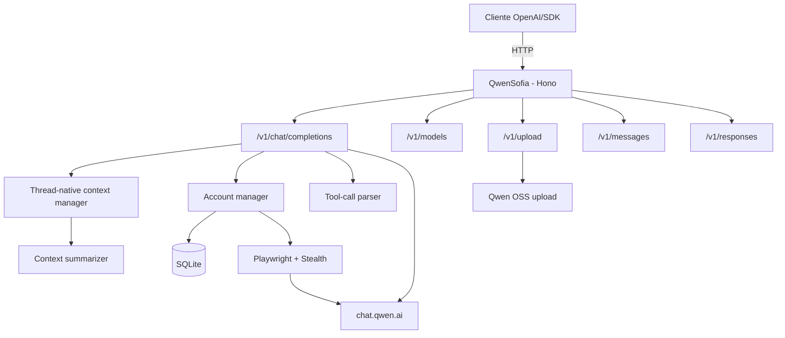

# QwenSofia

Gateway com compatibilidade parcial com as APIs OpenAI e Anthropic que conecta clientes ao **Qwen (`chat.qwen.ai`)**. O núcleo oferece Chat Completions, Responses API, múltiplas contas, tool calling reconstruído a partir da saída do modelo, uploads multimodais no fluxo Chat e sessões persistentes. Também inclui Playwright com stealth, rotação com cooldown, sumarização de contexto, cache comprimido e observabilidade.

O **QwenSofia** é uma distribuição independente baseada no [QwenBridge](https://github.com/johngbl/qwenproxy-old), com funcionalidades incorporadas do fork [QwenProxy-Saints](https://github.com/SaintsDEV/QwenProxy-Saints). Ela adiciona **painel web de contas**, **criação/autenticação automática** e **auto-create no rate limit** — sem versionar banco SQLite, senhas ou perfis de browser.

[](https://github.com/SNollken/QwenSofia/actions/workflows/ci.yml)
[](https://www.typescriptlang.org/)
[](https://hono.dev/)
[](LICENSE)

---

## Principais funcionalidades

- **Chat Completions (OpenAI-like)** — Streaming, non-streaming, tools, histórico e multimodal nos formatos tratados pelo projeto.
- **Responses API (OpenAI-like)** — Texto, function tools, streaming e `previous_response_id` em memória; recursos avançados têm limitações documentadas abaixo.
- **Compatibilidade Anthropic parcial** — `/v1/messages` oferece texto, streaming e tools básicos, mas ainda não tem paridade total com o SDK/API oficial.
- **Playwright com stealth** — Captura de headers reais (`bx-ua`, `bx-umidtoken`) por conta com `playwright-extra` e `puppeteer-extra-plugin-stealth`.
- **Anti-bot retry** — Detecção automática de `FAIL_SYS_USER_VALIDATE`/`RGV587_ERROR` com retry e rotação de conta.
- **Dynamic timeouts** — Timeout baseado no tamanho do payload (`120s + 30s/MB`).
- **Limites de payload** — Teto de transporte configurável (120 MiB por padrão) e teto de 50 MiB no payload encaminhado ao Qwen.
- **Modelo normalizado** — O catálogo público expõe `qwen3.8-max`; aliases recebidos nas rotas de geração são normalizados para esse modelo.
- **Provider público** — O endpoint `/v1/models` identifica o modelo como `QwenSofia` no campo `owned_by`.
- **Múltiplas contas** — Rotação round-robin, cooldown automático e inicialização paralela.
- **Aplicação de gerenciamento** — Painel local (`/`) e janela desktop para listar, adicionar, autenticar, remover e acompanhar contas.
- **Cadastro assistido** — Preenche o cadastro do Qwen, mostra o CAPTCHA no painel para a verificação humana e incorpora a sessão confirmada ao pool.
- **Criação automática de contas (dependente do upstream)** — Quando todas as contas ficam indisponíveis, tenta criar e autenticar uma nova conta. O resultado depende do fluxo atual do Qwen, CAPTCHA e e-mail temporário.
- **Auto-auth no pool** — Contas adicionadas/criadas pelo painel ou API entram autenticadas no pool (Playwright).
- **Persistência de sessão** — Cookies/JWT do Qwen persistidos por conta no SQLite.
- **Uploads multimodais** — Imagens, vídeo, áudio e documentos enviados ao OSS do Qwen.
- **Tool calling por adaptação** — Injeta instruções no prompt e reconstrói chamadas com um parser tolerante a stream fragmentado, JSON malformado e blocos XML/Hermes-style; não é tool calling nativo do backend.
- **Gerenciamento de contexto** — Truncamento, sumarização, rollover e preservação de sessão thread-native.
- **Cache com compressão Brotli** — TTL em memória, métricas e serialização segura.
- **Observabilidade** — `/health`, `/metrics`, watchdog e métricas Prometheus.
- **Execução local e Docker** — `npm`, imagem Playwright e graceful shutdown, observando os requisitos de segurança descritos abaixo.

---

## Origem e manutenção

O projeto tem como base o [QwenBridge](https://github.com/johngbl/qwenproxy-old) e também incorpora funcionalidades do [QwenProxy-Saints](https://github.com/SaintsDEV/QwenProxy-Saints). O código original e a licença ISC permanecem atribuídos a **Pedro Farias**. A distribuição `QwenSofia` e suas adaptações são mantidas por **Sofia**. O histórico Git foi preservado para que a origem de cada alteração continue auditável.

Por compatibilidade com instalações e clientes existentes, alguns identificadores internos ainda usam o nome legado, como `QWENBRIDGE_DB_PATH`, `qwenbridge.db`, chaves de cache/localStorage e o header `X-QwenBridge-Timing`.

---

## Privacidade no GitHub

Este projeto **não deve versionar** dados de contas. O `.gitignore` cobre:

| Item | Path típico | Motivo |
|---|---|---|
| SQLite | `data/db/qwenbridge.db` (+ `-wal`/`-shm`) | Contas, cooldowns, sessões |
| Chave de criptografia | `data/db/.encryption_key` | Descriptografa senhas no DB |
| Perfis Playwright | `data/qwen_profiles/` | Cookies/JWT do Qwen |
| Exports | `accounts.txt`, `accounts.json`, `cookies.json` | Credenciais em texto |
| Env local | `.env` | Senhas e tokens |

Use apenas `.env.example` no repositório. Antes do primeiro push do projeto:

```bash
git status --ignored
# confira que data/, *.db, .env e accounts.* estão ignorados
```

---

## Arquitetura



---

## Autenticação

QwenSofia usa Playwright para autenticação e acesso ao Qwen. Cada conta ativa pode abrir uma sessão real de browser para capturar cookies e headers anti-bot (`bx-ua`, `bx-umidtoken`, `bx-v`). O funcionamento depende da interface e das proteções atuais de `chat.qwen.ai`.

```env
PLAYWRIGHT_HEADLESS=true
PLAYWRIGHT_BROWSER=chromium
```

**Requisitos:**
```bash
npx playwright install chromium
```

---

## Modelos e contexto

O proxy expõe somente `qwen3.8-max` via `/v1/models` e normaliza os aliases recebidos pelas rotas de geração para esse modelo. Variantes com sufixo `-no-thinking` podem ser aceitas internamente para desativar reasoning, mas não são anunciadas no catálogo público.
O campo público `owned_by` usa o nome do provider `QwenSofia`.

| Modelo | Contexto | Divisor de tokens |
|---|---|---|
| `qwen3.8-max` | 500.000 | 2.2 |

---

## Pré-requisitos

| Dependência | Versão mínima | Observação |
|---|---:|---|
| Node.js | 20+ | Recomendado usar LTS |
| npm | 9+ | Incluído com Node |
| Playwright | - | Necessário para autenticação/acesso ao Qwen (`npx playwright install chromium`) |
| Docker | opcional | Para deploy em container |

---

## Instalação

### Via npm

```bash
git clone https://github.com/SNollken/QwenSofia.git
cd QwenSofia
npm install
npx playwright install chromium
```

### Via Docker

Defina credenciais antes de iniciar. O Compose faz bind do app em `0.0.0.0` dentro do container; por segurança, o servidor recusa esse bind sem `API_KEY` e `ADMIN_TOKEN`.

```env
API_KEY=troque-por-uma-chave-forte
ADMIN_TOKEN=troque-por-outro-token-forte
```

```bash
docker-compose up -d
```

A porta é publicada apenas no loopback do host (`127.0.0.1`) pela configuração padrão do Compose.

---

## Início rápido

Crie um `.env` na raiz. O `.env.example` contém as opções mais comuns; a seção de variáveis abaixo documenta os principais controles do projeto.

### Exemplo mínimo

```env
QWEN_ACCOUNTS=user1@example.com:senha1;user2@example.com:senha2
```

> **Dica:** Use `;` como separador preferencial de contas para evitar conflito com `,` em senhas.
> O formato legado com `,` continua aceito.
> Senhas com `:`, `#`, espaços e outros caracteres especiais funcionam normalmente.

### Iniciar

```bash
npm start
```

O painel de gerenciamento fica disponível em:

```text
http://127.0.0.1:3000/
```

Para iniciar como aplicação desktop:

```bash
npm run desktop
```

### Painel (dashboard)

| Ação | O que faz |
|---|---|
| **Fila de contas** | Lista contas do pool (e-mail, id, autenticada/inativa, cooldown) |
| **Adicionar conta** | Conta existente → salva criptografada + autentica + entra no pool |
| **Criar conta** | Cadastro com e-mail/senha que você define (browser Playwright) |
| **Criar automática** | Gera e-mail/senha aleatórios, autentica e adiciona ao pool |
| **Autenticar / Remover** | Revalida sessão ou remove conta + perfil local |
| **Configuração** | Base URL, API key e `ADMIN_TOKEN` opcional |

Quando exigido pelo Qwen, o CAPTCHA aparece no painel: arraste a peça na imagem e o navegador do cadastro recebe sua trajetória. A confirmação de e-mail segue automática para caixas temporárias. Depois disso a conta é autenticada e inserida no pool automaticamente.

### Auto-create no rate limit (experimental)

Quando o pool inteiro está em cooldown/rate limit (ou não há contas):

1. O proxy **não força** limpar cooldowns (com auto-create ativo)
2. Dispara o criador automático **completo**
3. Gera um e-mail temporário e preenche o cadastro no Qwen
4. Pausa no CAPTCHA atual e o apresenta no painel para o arraste manual; depois verifica o e-mail e captura cookies/sessão
5. Só marca `ready=true` depois do Playwright do pool autenticar de verdade
6. **Retenta a request** com a conta nova

Esse fluxo não é garantido: mudanças no site do Qwen, bloqueios anti-bot, indisponibilidade do provedor de e-mail ou CAPTCHA podem interrompê-lo. Se houver CAPTCHA, o job fica aguardando no painel até o arraste humano. A conta **não** entra no pool até uma sessão autenticada ser capturada.

Desative com `ACCOUNT_CREATOR_ENABLED=false`.

---

## Testes

```bash
npm test           # Suite mock seguida dos testes live
npm run test:mock  # Só mocks
npm run test:live  # Integração real; exige contas/Qwen acessíveis
```

Os testes mock validam o comportamento interno sem comprovar a disponibilidade do Qwen, CAPTCHA, e-mail temporário ou outros serviços externos. Os testes `dashboard-metrics.test.ts` e `personalization-flow.test.ts` existem no repositório, mas ainda não fazem parte dos scripts acima.

---

## Variáveis de ambiente

### Rede e segurança

| Variável | Default | Descrição |
|---|---|---|
| `PORT` | `3000` | Porta HTTP do proxy. |
| `HOST` | `127.0.0.1` | Host de bind. Bind não local exige `API_KEY` e `ADMIN_TOKEN`. |
| `API_KEY` | vazio | Protege rotas `/v1/*` com `Authorization: Bearer ...`. |
| `ADMIN_TOKEN` | vazio | Protege `/api/admin/*` quando o bind não é loopback; informe o mesmo token no painel. |
| `MAX_REQUEST_BODY_BYTES` | `125829120` | Teto do corpo HTTP (120 MiB). O payload encaminhado ao Qwen tem teto adicional de 50 MiB. |

### Autenticação e sessão

| Variável | Default | Descrição |
|---|---|---|
| `QWEN_ACCOUNTS` | vazio | Contas no formato `email1:senha1;email2:senha2`. Use `;` como separador (`,` como fallback legacy). Senhas com `:`, `#`, espaços funcionam normalmente. |
| `DELETE_ALL_CHATS_ON_SHUTDOWN` | `false` | Limpa chats no shutdown. |

### Playwright

| Variável | Default | Descrição |
|---|---|---|
| `PLAYWRIGHT_HEADLESS` | `true` | Browser headless (sem janela). |
| `PLAYWRIGHT_BROWSER` | `chromium` | Navegador: `chromium`, `chrome`, `edge`. |
| `PLAYWRIGHT_INIT_BATCH_SIZE` | `1` | Quantas contas inicializar em paralelo no startup. Use baixo para evitar pico de RAM. |
| `PLAYWRIGHT_CONTEXT_CLOSE_TIMEOUT_MS` | `10000` | Timeout para fechar contexto/browser antes do kill best-effort. |
| `PLAYWRIGHT_IDLE_CONTEXT_TTL_MS` | `600000` | Fecha contextos Playwright ociosos após esse tempo (`0` desativa). |
| `ACCOUNT_MAX_CONCURRENT_REQUESTS` | `2` | Máximo de requisições simultâneas por conta; as seguintes aguardam uma vaga. |
| `ACCOUNT_REQUEST_QUEUE_TIMEOUT_MS` | `120000` | Tempo máximo aguardando uma vaga antes de retornar `503`; adequado para respostas Playwright longas. |
| `PREPARE_ALL_ON_STARTUP` | `false` | Prepara todas as contas disponíveis no startup e repara contas ausentes no keep-alive. |
| `SESSION_KEEP_ALIVE_ENABLED` | `false` | Mantém sessões ativas com atividade leve apenas quando a conta está ociosa. Opt-in para evitar Chromes permanentes. |
| `SESSION_KEEP_ALIVE_INTERVAL_MS` | `180000` | Intervalo entre ciclos de keep-alive/limpeza. |
| `SESSION_KEEP_ALIVE_IDLE_MS` | `120000` | Tempo mínimo sem uso antes de uma conta ser elegível ao keep-alive. |
| `SESSION_KEEP_ALIVE_NAVIGATION_INTERVAL_MS` | `480000` | Intervalo mínimo para navegação leve de validação durante keep-alive. |

### Headers anti-bot

| Variável | Default | Descrição |
|---|---|---|
| `USER_AGENT` | Chrome 149 Windows | User-Agent fallback para Playwright/downloads. |
| `QWEN_BX_V` | `2.5.36` | Versão `bx-v` fallback; `bx-ua` e `bx-umidtoken` são capturados do browser. |

O Playwright também aplica um fingerprint estável por conta (UA Chrome 149, locale, viewport, hardware e WebGL coerentes) para reduzir inconsistências sem trocar a arquitetura thread-native/tools do fork.

### Delays e retry

| Variável | Default | Descrição |
|---|---|---|
| `RETRY_BASE_DELAY_MS` | `1000` | Delay base para retries (exponential backoff). |
| `RETRY_MAX_DELAY_MS` | `10000` | Cap do exponential backoff. |
| `ANTI_BOT_BASE_DELAY_MS` | `5000` | Delay base para erros anti-bot. |
| `ANTI_BOT_MAX_DELAY_MS` | `30000` | Cap do exponential backoff anti-bot. |
| `ACCOUNT_COOLDOWN_MS` | `60000` | Cooldown padrão (Qwen sobrescreve quando informa tempo). |

### Criador automático de contas

| Variável | Default | Descrição |
|---|---|---|
| `ACCOUNT_CREATOR_ENABLED` | `true` | Cria conta nova quando o pool está esgotado (rate limit/cooldown/vazio). |
| `ACCOUNT_CREATOR_TIMEOUT_MS` | `600000` | Timeout máximo por cadastro (CAPTCHA/e-mail podem demorar). |
| `ACCOUNT_CREATOR_COOLDOWN_MS` | `30000` | Intervalo mínimo entre criações automáticas. |
| `ACCOUNT_CREATOR_MAX_BATCH` | `5` | Máximo de contas por chamada manual/batch. |
| `ACCOUNT_CREATOR_AUTO_AUTH` | `true` | Autentica automaticamente ao adicionar conta via admin/API. |
| `ACCOUNT_CREATOR_FORCE_HEADLESS` | `false` | Força headless no cadastro; o CAPTCHA continua apresentado no painel, mas o upstream pode recusá-lo. |

### Timeouts

| Variável | Default | Descrição |
|---|---|---|
| `HTTP_TIMEOUT` | `10000` | Timeout HTTP genérico. |
| `TOTAL_REQUEST_TIMEOUT` | `300000` | Timeout máximo de geração. |
| `REASONING_MODEL_TIMEOUT` | `600000` | Timeout para modelos com reasoning. |

**Nota:** O timeout do request ao Qwen é calculado como `120s + 30s por MiB de payload`. Com reasoning ativo, nunca fica abaixo de `REASONING_MODEL_TIMEOUT`. `TOTAL_REQUEST_TIMEOUT` é um limite separado do ciclo completo da rota.

### Cache

| Variável | Default | Descrição |
|---|---|---|
| `CACHE_TTL` | `3600` | TTL do cache em segundos. |
| `CACHE_COMPRESSION_ENABLED` | `true` | Compressão Brotli. |

### Contexto

| Variável | Default | Descrição |
|---|---|---|
| `CONTEXT_SUMMARIZATION_ENABLED` | `true` | Sumarização do contexto thread-native. |

A sumarização usa sempre `qwen3.8-max`.

### Observabilidade

| Variável | Default | Descrição |
|---|---|---|
| `METRICS_INTERVAL` | `10000` | Intervalo de métricas. |
| `WATCHDOG_INTERVAL` | `5000` | Intervalo do watchdog. |
| `RAM_WARNING` | `80` | % RAM para warning. |
| `RAM_CRITICAL` | `95` | % RAM para critical. |

---

## Anti-bot

O QwenSofia detecta automaticamente erros de anti-bot:

- `FAIL_SYS_USER_VALIDATE`
- `RGV587_ERROR`

**Fluxo:**
1. Erro detectado → retry com delay exponencial + jitter
2. Retry falha → rotação para próxima conta
3. Todas em rate limit/cooldown → **criação automática de conta** (se habilitada) e retentativa
4. Se ainda falhar → erro retornado ao cliente

**Com Playwright:** Cada conta tem seu próprio fingerprint (`bx-ua`, `bx-umidtoken`) capturado do browser real.

---

## Endpoints

### Estado de compatibilidade

| Interface | Estado | Limitações relevantes |
|---|---|---|
| Chat Completions | Funcional, compatibilidade parcial | Tool calls são reconstruídas por prompt/parser; vários parâmetros avançados da OpenAI não têm suporte comprovado. |
| Responses API | Funcional para texto e function tools | Built-in tools (`web_search`, `file_search`, `shell`, `code_interpreter`, MCP etc.) são aceitas pelo schema, mas não executadas. `input_image` e `input_file` ainda não chegam ao backend. |
| Anthropic Messages | Funcional para texto e tools básicos | Com `API_KEY`, o fluxo atual pode exigir `Authorization: Bearer` e `x-api-key`; multimodal/documentos e alguns campos são parciais. A contagem de tokens é estimada. |
| Modelos | Funcional em formato OpenAI-like | Há duas implementações de `/v1/models`; a resposta específica Anthropic pode ser sombreada pela rota registrada primeiro. |

O projeto não implementa `/v1/completions` (Completions legacy). O estado de `previous_response_id` da Responses API fica somente em memória, expira após 24 horas e não sobrevive ao reinício. Consulte [`docs/rotas-compatibilidade-confirmada.md`](docs/rotas-compatibilidade-confirmada.md) para a matriz técnica detalhada.

### OpenAI Compatible

| Rota | Método | Descrição |
|---|---|---|
| `/v1/chat/completions` | POST | Chat completions (streaming + non-streaming) |
| `/v1/chat/completions/stop` | POST | Abortar geração ativa |
| `/v1/models` | GET | Listar modelos |
| `/v1/models/:id` | GET | Modelo específico |

### OpenAI Responses API

| Rota | Método | Descrição |
|---|---|---|
| `/v1/responses` | POST | Geração em formato Responses (streaming + non-streaming) |
| `/v1/responses/:response_id` | GET | Recuperar resposta ainda armazenada em memória |
| `/v1/responses/:response_id` | DELETE | Remover resposta do armazenamento em memória |

### Anthropic Compatible

| Rota | Método | Descrição |
|---|---|---|
| `/v1/messages` | POST | Mensagens (formato Anthropic) |
| `/v1/messages/count_tokens` | POST | Contar tokens |

### Utilidades

| Rota | Método | Descrição |
|---|---|---|
| `/` | GET | Dashboard web (contas / criação) |
| `/health` | GET | Health check |
| `/metrics` | GET | Métricas Prometheus |
| `/v1/upload` | POST | Upload de arquivos |

### Admin (painel / automação)

> Em bind não local, configure `ADMIN_TOKEN` e envie o header `X-Admin-Token`. Em loopback, as rotas administrativas são locais e não exigem esse header no comportamento atual.

| Rota | Método | Descrição |
|---|---|---|
| `/api/admin/overview` | GET | Contas, jobs de cadastro, status do auto-creator e base URL |
| `/api/admin/accounts` | POST | Adiciona conta (`email`, `password`; autentica por padrão) |
| `/api/admin/accounts/:id` | DELETE | Remove conta + sessão/perfil local |
| `/api/admin/accounts/:id/authenticate` | POST | Reautentica conta no Playwright |
| `/api/admin/registrations` | POST | Cadastro assistido com e-mail/senha informados |
| `/api/admin/registrations/:id` | GET | Status do job de cadastro |
| `/api/admin/registrations/:id/captcha` | GET | Imagem PNG sem cache do CAPTCHA aguardando no job |
| `/api/admin/registrations/:id/captcha/drag` | POST | Envia a trajetória normalizada do arraste (`{"points":[{"x":0,"y":0,"t":0}]}`) |
| `/api/admin/account-creator` | GET | Status do criador automático |
| `/api/admin/account-creator/run` | POST | Cria N contas automáticas (`{"count":1}`; `?wait=1` espera o fim) |

---

## Exemplos de uso

### OpenAI SDK (Node.js)

```typescript
import OpenAI from "openai";

const client = new OpenAI({
  baseURL: "http://localhost:3000/v1",
  apiKey: "sua-api-key",
});

const completion = await client.chat.completions.create({
  model: "qwen3.8-max",
  messages: [{ role: "user", content: "Hello!" }],
});

console.log(completion.choices[0].message.content);
```

### Anthropic SDK

```typescript
import Anthropic from "@anthropic-ai/sdk";

const client = new Anthropic({
  baseURL: "http://localhost:3000",
  apiKey: "sua-api-key",
  // Necessário no comportamento atual quando API_KEY está configurada:
  defaultHeaders: { Authorization: "Bearer sua-api-key" },
});

const message = await client.messages.create({
  model: "qwen3.8-max",
  max_tokens: 1024,
  messages: [{ role: "user", content: "Hello!" }],
});

console.log(message.content[0].text);
```

### cURL

```bash
curl http://localhost:3000/v1/chat/completions \
  -H "Content-Type: application/json" \
  -H "Authorization: Bearer sua-api-key" \
  -d '{
    "model": "qwen3.8-max",
    "messages": [{"role": "user", "content": "Hello!"}],
    "stream": true
  }'
```

---

## Tool calling

O parser suporta:
- Tags `<tool_call>` XML
- Formato Hermes-style
- JSON malformado (strings sem aspas, quotes escapadas)
- Stream fragmentado

---

## Anthropic Model Mapping

| Claude Model | Qwen Model |
|---|---|
| Qualquer modelo | `qwen3.8-max` |

---

## Deploy com Docker

```yaml
services:
  qwensofia:
    build: .
    container_name: qwensofia
    ports:
      - "127.0.0.1:${PORT:-3000}:3000"
    env_file:
      - .env
    environment:
      - HOST=0.0.0.0
    volumes:
      - ./data:/app/data
    restart: unless-stopped
    logging:
      driver: "json-file"
      options:
        max-size: "10m"
        max-file: "3"
```

O container ajusta permissões no startup para `data/db` e `data/qwen_profiles`, evitando falhas comuns com volumes bind-mounted.
Como o bind interno não é loopback, `API_KEY` e `ADMIN_TOKEN` precisam estar definidos no `.env`.

---

## Estrutura do projeto

```
QwenSofia/
├── src/
│   ├── api/              # Server, models, error helpers
│   ├── cache/            # Memory cache com Brotli
│   ├── core/             # Config, accounts, database, metrics
│   ├── routes/
│   │   ├── anthropic/    # Anthropic API compatible
│   │   ├── chat/         # Chat completions, streaming
│   │   └── responses/    # Responses API compatible
│   ├── services/
│   │   ├── auth-playwright.ts # Headers Playwright + mock de testes
│   │   ├── playwright.ts      # Playwright + stealth
│   │   └── qwen.ts            # Qwen API integration
│   ├── tools/                 # Tool-call instructions, parser e schema
│   └── utils/                 # JSON parser, token estimation, context summary
├── data/                 # SQLite, encryption key e profiles (gitignored)
├── Dockerfile
├── docker-compose.yml
└── package.json
```

---

## Scripts úteis

| Comando | Descrição |
|---|---|
| `npm start` | Iniciar servidor |
| `npm run desktop` | Iniciar servidor e painel em uma janela desktop |
| `npm run login` | Gerenciar contas |
| `npm test` | Rodar a suite mock e depois os testes live |
| `npm run test:mock` | Testes com mock |
| `npm run test:live` | Testes reais; exigem contas e upstream acessível |
| `npm run typecheck` | Verificar tipos |


---

## Troubleshooting

| Problema | Solução |
|---|---|
| Anti-bot bloqueando | Refaça login da conta e verifique se o Playwright está capturando headers |
| Quota exceeded | Adicione mais contas ou espere cooldown |
| Timeout em requests grandes | Aumente `TOTAL_REQUEST_TIMEOUT` |
| Playwright não inicia | Execute `npx playwright install chromium` |
| Porta em uso | Altere `PORT` no `.env` |
| Sessão expirada | Execute `npm run login` para renovar |

---

## Disclaimer

Este projeto é fornecido para fins educacionais e de pesquisa. Use por sua conta e risco.
